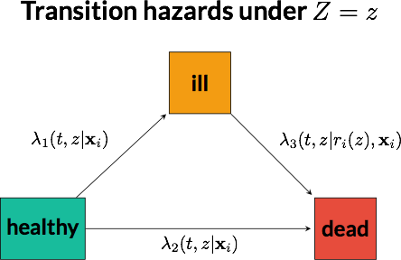

## Semicompeting risks and principal stratification

### Notation 

For individuals $i=1,\dots, n$:

* $Z_i$: some randomized binary treatment
* $\mathbf{X}_i$: set of observed baseline covariates
* $T_i(z)$: potential death time under $Z=z$
* $R_i(z)$: potential readmission time under $Z=z$, where $\bar{\mathbb{R}}$ is a non-real number indication that death occurred without a hospital readmission
* $C_i$: non-informative right censoring time
* $Y^R_i(z)$ : $\min \left(R_i(z), T_i(z), C_i\right)$
* $\delta^R_i(z)$: event indicator for observing readmission under $Z = z$
* $Y^T_i(z)$: $\min \left(T_i(z), C_i\right)$
* $\delta^T_i(z)$: event indicator for observing death under $Z = z$

### Illness-death processes as compartmental models

Semicompeting risks problems can be drawn as compartmental models with transition rates between compartments:

### Individual-level frailties inducing positive correlation among $\left(R_i(0), R_i(1), T_i(0), T_i(1)\right)$

A subject-specific frailty parameter $\gamma_i$ captures literal *frailty* that leads to both earlier death and the need for hospital readmission, regardless of treatment status. The frailties capture heterogeneity in prognoses related to omitted or unmeasured shared baseline predictors of hospital readmission and death. When $\sigma$ is set to zero in the app, there is no induced correlation (i.e., $\gamma_i \equiv 1 \ \forall \ i$). Larger $\sigma$ means that there is greater correlation among $\left(R(0), R(1), T(0), T(1)\right)$.

\[ \gamma_i \sim \mathrm{Gamma}(\sigma^{-1}, \sigma^{-1}) \]

### Non-terminal event (hospital readmission) ($R$ model)

$R(z)$, the potential readmission time under $Z=z$, is a mixed distribution. When the time until hospital readmission is truncated by death (i.e., death occurs without readmission having occurred ), $R(z)$ is set to a non-real number, $\bar{\mathbb{R}}$. (For the purposes of operators such as $\mathrm{min}(\bar{\mathbb{R}}, \cdot)$ and $\mathrm{max}(\bar{\mathbb{R}}, \cdot)$, one can think of $\bar{\mathbb{R}}$ as $\infty$.)

A Weibull proportional hazards model is adopted for the hazard of readmission, which depends on $Z = z$:

\[ 
\lambda_1(t, z | \mathbf{x}_i)  = 
(1-z) \gamma_i \alpha_1 \kappa_1 t^{\alpha_1 - 1} \exp \left\{ \mathbf{x}_i' \boldsymbol{\beta}_1 \right\} + 
z \gamma_i \alpha_4 \kappa_4 t^{\alpha_4 - 1} \exp \left\{ \mathbf{x}_i' \boldsymbol{\beta}_1 \right\}
\]

### Death ($T$ model), without a prior readmission

$T(z)$ is the potential death time under $Z=z$. 

\[ 
\lambda_2(t, z | \mathbf{x}_i)  = 
(1-z) \gamma_i \alpha_2 \kappa_2 t^{\alpha_2 - 1} \exp \left\{ \mathbf{x}_i' \boldsymbol{\beta}_2 \right\} + 
z \gamma_i \alpha_5 \kappa_5 t^{\alpha_5 - 1} \exp \left\{ \mathbf{x}_i' \boldsymbol{\beta}_2 \right\}
\]

### Death ($T$ model), after the non-terminal event readmission event

Being readmitted to the hospital may change the hazard of death. We use a Weibull proportional hazards model with a semi-Markov formulation; that is, the hazard of death at time $t > r_i(z)$ depends only on $r_i(z)$ through $(t-r_i(z))$. For a moment, consider the no-frailty case where $\gamma_i=1 \ \forall i$. Then two similar patients who are both alive at 35 days that were rehospitalized at 15 and 30 days, respectively, will have different hazards of death at Day 46. This is because one patient is 20 days post-readmission and the other is only 5 days post-readmission. Meanwhile, two patients with identical covariate patterns will experience the same hazard of death 10 days after rehospitalization, regardless of whether the rehospitalization occurs at Day 15 or Day 30.

\[ 
\lambda_3(t, z | r_i(z), \mathbf{x}_i)  = 
(1-z) \gamma_i \alpha_3 \kappa_3 \left(t - r_i(z)\right)^{\alpha_3 - 1} \exp \left\{ \mathbf{x}_i' \boldsymbol{\beta}_3 \right\} + 
z \gamma_i \alpha_6 \kappa_6 \left(t - r_i(z)\right)^{\alpha_6 - 1} \exp \left\{ \mathbf{x}_i' \boldsymbol{\beta}_3 \right\}
\]
